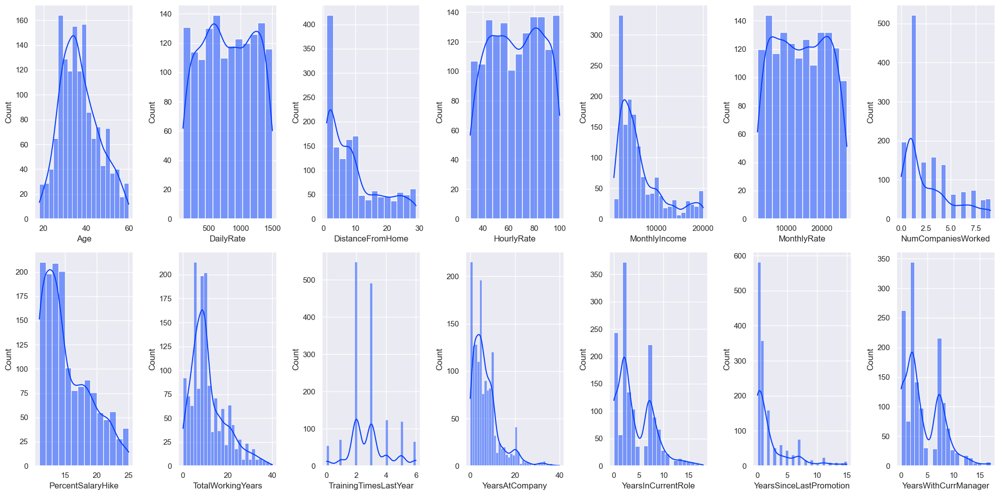
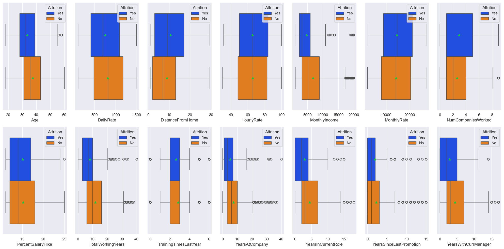
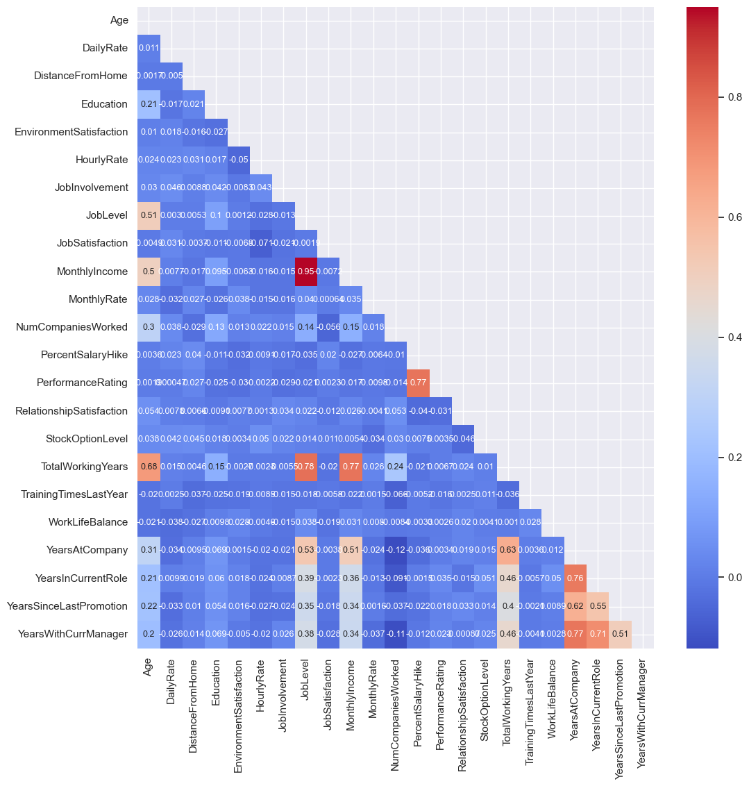
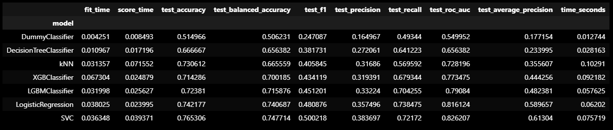
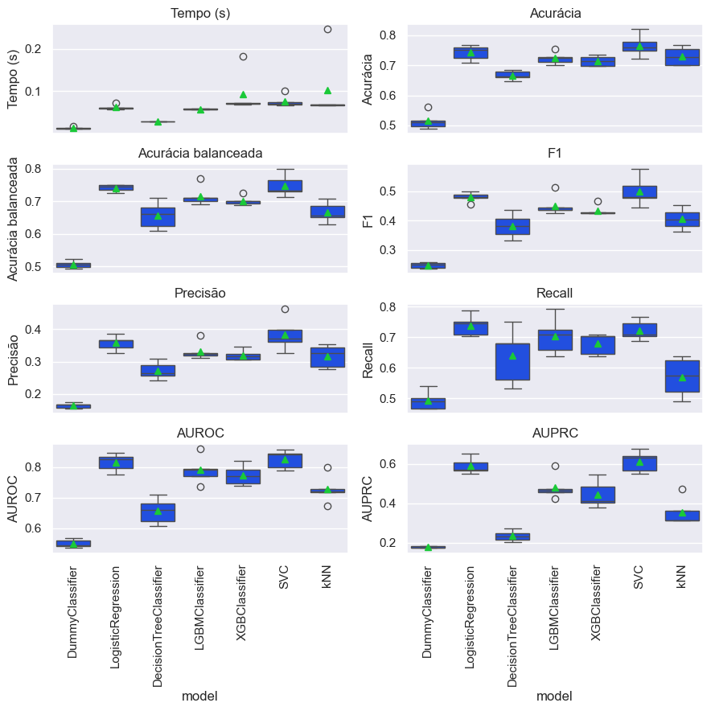

## 💼 Predição de Churn de Funcionários - IBM HR Analytics

Este projeto tem como objetivo desenvolver um modelo de *machine learning* capaz de prever a saída (churn/attrition) de funcionários com base em dados de Recursos Humanos da IBM. 

O projeto foi desenvolvido como parte do curso de Ciência de Dados.

### 📊 Dataset

O dataset utilizado foi obtido no Kaggle:
[IBM HR Analytics Employee Attrition & Performance](https://www.kaggle.com/datasets/pavansubhasht/ibm-hr-analytics-attrition-dataset)

Ele contém informações sobre 1.470 funcionários, com variáveis como idade, cargo, tempo de empresa, satisfação no trabalho, entre outras.


### 🔍 Etapas do Projeto

#### 1. Análise Exploratória de Dados (EDA)

* Análise univariada e bivariada das variáveis.
* Verificação de dados ausentes e tratamento de inconsistências.
* Visualizações para entender padrões de attrition.
* Correlações entre variáveis.

---

### Histograma



### Boxplot 



### HeatMap 



---

#### 2. Pré-processamento

* Codificação de variáveis categóricas.
* Normalização de dados numéricos.
* Separação entre features e target.
* Divisão entre dados de treino e teste.


---
#### 3. Modelagem Preditiva

* Teste com diferentes algoritmos de classificação.
* **Modelo final escolhido:** `LogisticRegression`
* Avaliação com métricas como:

  * Acurácia
  * Matriz de Confusão
  * ROC AUC
  * Precisão e Recall



---

### 🧠 Resultado

O modelo de **Regressão Logística** foi o que apresentou melhor desempenho, equilibrando simplicidade e performance. Ele se mostrou eficaz na detecção de funcionários com maior probabilidade de sair da empresa.

Apesar do modelo SVC ter obtido um melhor resultado de score, o LogistcRegression foi escolhido devido ter resultados melhores nas métricas como: recall, menor tempo de treinamento e por ser de mais fácil interpretação.



---

### 🛠️ Tecnologias Utilizadas

* Python 3
* Pandas, NumPy
* Matplotlib, Seaborn
* Scikit-learn
* Jupyter Notebook

### 📌 Observações

Este projeto é de caráter acadêmico e demonstra conhecimentos em análise de dados, visualização e machine learning aplicados a um problema de negócios.


## Organização do projeto

```
├── .env               <- Arquivo de variáveis de ambiente (não versionar)
├── .gitignore         <- Arquivos e diretórios a serem ignorados pelo Git
├── ambiente.yml       <- O arquivo de requisitos para reproduzir o ambiente de análise
├── LICENSE            <- Licença
├── README.md          <- README principal para desenvolvedores que usam este projeto.
|
├── dados              <- Arquivos de dados para o projeto.
|
├── modelos            <- Modelos treinados e serializados, previsões de modelos ou resumos de modelos
|
├── notebooks          <- Cadernos Jupyter. A convenção de nomenclatura é um número (para ordenação),
│                        as iniciais do criador e uma descrição curta separada por `-`, por exemplo
│                         `01-jn-exploracao-inicial-de-dados`.
│
|   └──src             <- Código-fonte para uso neste projeto.
|      │
|      ├── __init__.py  <- Torna um módulo Python
|      ├── config.py    <- Configurações básicas do projeto
|      └── graficos.py  <- Scripts para criar visualizações exploratórias e orientadas a resultados
|      └── auxiliares.py   <- função auxiliar
|      └── models.py   <- funções auxiliares para construção de pipeline e grid search
|      └── models_rus.py   <- funções auxiliares para construção de pipeline e grid search, versão para under sampling
|
|
├── referencias        <- Dicionários de dados, manuais e todos os outros materiais explicativos.
|
├── relatorios         <- Análises geradas em HTML, PDF, LaTeX, etc.
│   └── imagens        <- Gráficos e figuras gerados para serem usados em relatórios
```

## Configuração do ambiente

1. Faça o clone do repositório que será criado a partir deste modelo.

    ```bash
    git clone https://github.com/jnjunior-96/projeto_IBM.git
    ```

2. Crie um ambiente virtual para o seu projeto utilizando o gerenciador de ambientes de sua preferência.

    a. Caso esteja utilizando o `conda`, exporte as dependências do ambiente para o arquivo `ambiente.yml`:

      ```bash
      conda env export > ambiente.yml
      ```


### ✉️ Contato

Caso queira entrar em contato:

* **Nome:** \[José Nivaldo]
* **LinkedIn:** \[https://www.linkedin.com/in/jnjunior96/]
* **E-mail:** \[jnjunior96@outlook.com]
